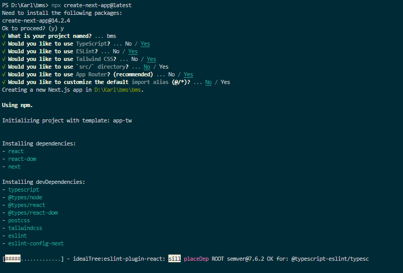
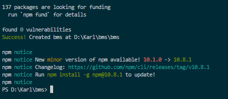

# bms

# Steps to Use this nextjs Web application for the hardware_bms
1. open cmd and create new nextjs app name it `bms`.
2. run command `npx create-next-app@latest` and then fill in the details below  

3. After it finishes it will look like this:  

4. copy the app directory and paste it inside the generated bms/ folder
5. go into the generated bms folder `cd bms`
6. install needed packages by running these commands:
```
npm i axios
npm i primereact
npm i chart.js
```
7. after installing you can now run it by running the command:
```
npm run dev
```
